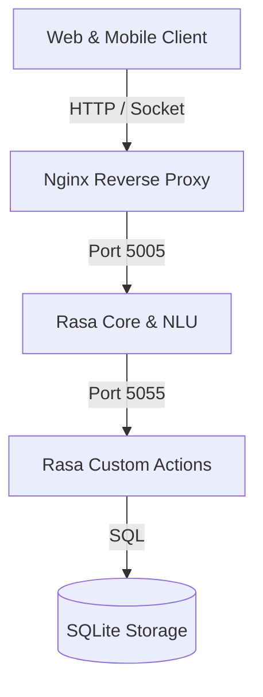

# Documentation Generator Skill

Guidelines for producing crystal-clear, structured, maintainable technical documentation, guides, and diagrams.

## Documentation Structure
1. **Overview & High-Level Architecture**: Visual diagrams (Mermaid format), core value proposition, and tech stack overview.
2. **Prerequisites & Installation**: Exact, tested shell commands to set up the environment from scratch.
3. **Configuration Reference**: Environment variables, config files, and credential templates (`.env.example`).
4. **Usage & Runbooks**: Step-by-step instructions for running, testing, building, and deploying.
5. **API Reference**: Detailed endpoints, sample request/response payloads, and error codes.
6. **Troubleshooting FAQ**: Common errors and quick fixes.

## Mermaid Architecture Diagram Syntax
```markdown

```
