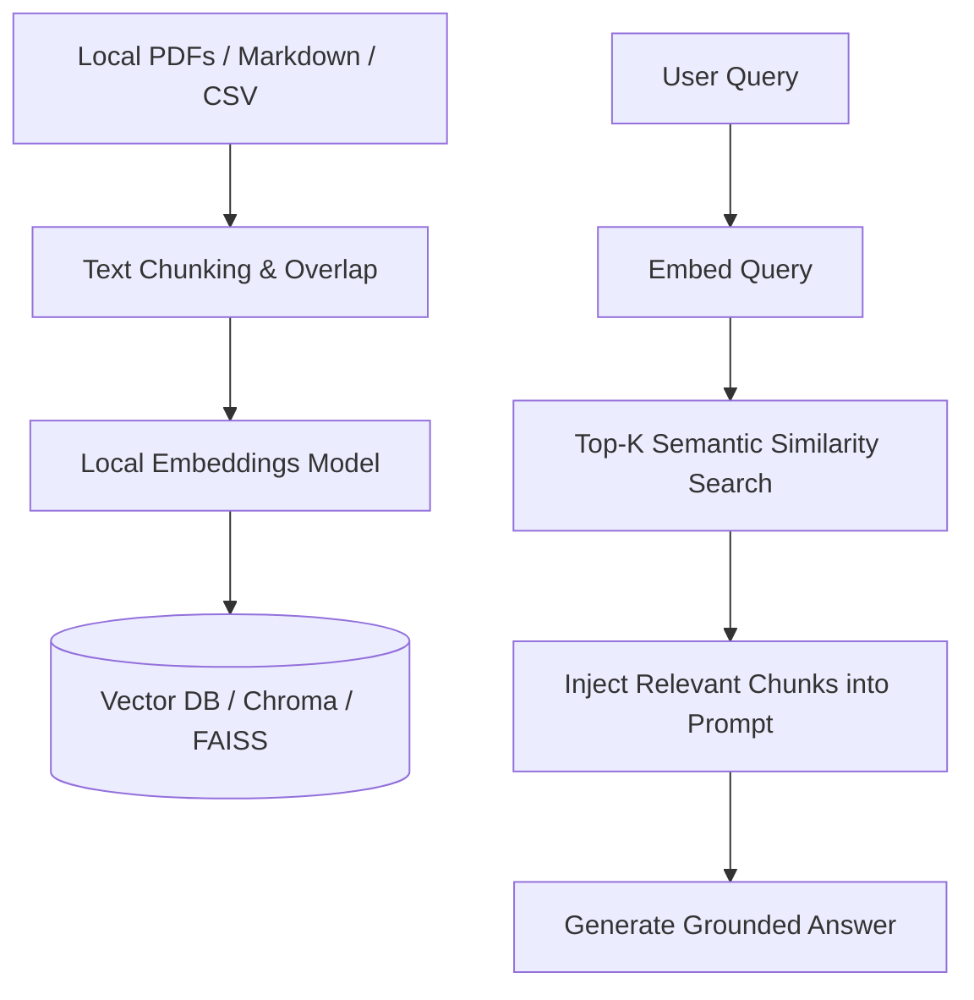

# Retrieval-Augmented Generation (RAG) Skill

Enables conversational question-answering over local documents, proprietary PDFs, codebase documentation, and knowledge archives.

## RAG Pipeline Architecture

## Recommended Tech Stack
* **Vector Store**: `chromadb` or `faiss-cpu`.
* **Embedding Model**: `sentence-transformers/all-MiniLM-L6-v2` (fast, lightweight, runs 100% locally).
* **Chunking Strategy**: 500-token chunks with 50-token overlap to maintain semantic continuity across boundaries.
