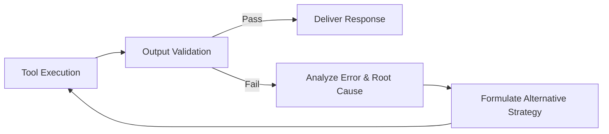

# Self-Reflection & Auto-Correction Skill

Enables the AI agent to evaluate its own tool outputs, catch errors before returning them to the user, and formulate corrective actions.

## 4-Phase Reflection Loop

## Reflection Protocol
1. **Schema & Constraint Check**: Verify tool outputs conform to expected types, bounds, and business constraints.
2. **Error Categorization**:
   * *Transient Error* (e.g. rate limit, 503): Exponential backoff and retry up to 3 times.
   * *Input Error* (e.g. 400 Bad Request, missing field): Sanitize payload and re-invoke.
   * *Semantic Error* (e.g. hallucinated key, unexpected format): Parse alternative output patterns.
3. **Budget Limit**: Max 3 auto-correction iterations per turn to prevent infinite loops.
